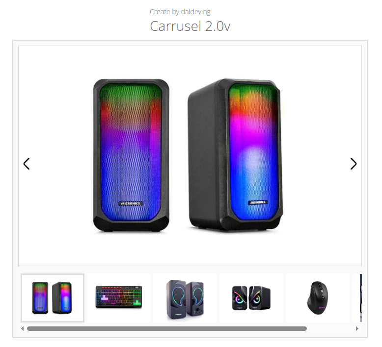

# 🚀 Carrusel 2.0v -- Proyecto by *daldeving*

Carrusel 2.0v es un proyecto desarrollado con HTML, CSS y JavaScript que
permite visualizar imágenes mediante un sistema de miniaturas y
navegación con botones.\
El carrusel permite seleccionar imágenes haciendo clic en sus miniaturas
y navegar entre ellas con los botones **Anterior** y **Siguiente**,
manteniendo sincronizado el borde de selección.

------------------------------------------------------------------------

## 📸 Vista del proyecto

------------------------------------------------------------------------

## ✨ Características principales

-   Miniaturas clickeables con selección visual.\
-   Navegación izquierda/derecha con actualización automática.\
-   Imagen principal sincronizada con la miniatura seleccionada.\
-   Código limpio, escalable y fácil de adaptar.\
-   Totalmente responsive.

------------------------------------------------------------------------

## 🛠️ Tecnologías usadas

-   **HTML5**\
-   **CSS3**\
-   **JavaScript (Vanilla)**

------------------------------------------------------------------------

## 📂 Estructura del proyecto

    /css
    /gallery
    /img (opcional)
    /js
    index.html
    README.md

------------------------------------------------------------------------

## 🎮 Funcionamiento

1.  Haz clic en cualquier miniatura para mostrarla como imagen
    principal.\
2.  Usa los botones **⬅** y **➡** para cambiar a la imagen anterior o
    siguiente.\
3.  El borde del card se actualiza automáticamente para indicar cuál
    está seleccionado.

------------------------------------------------------------------------

## 📌 Autor

Proyecto creado por **daldeving**\
Versión: **2.0v**

------------------------------------------------------------------------

## 📄 Licencia

Este proyecto es de uso libre para estudio y práctica personal.
